# 🤖 Sistem Absensi Cerdas — Face Recognition & GPS Tracking 

<div align="center">
<br>

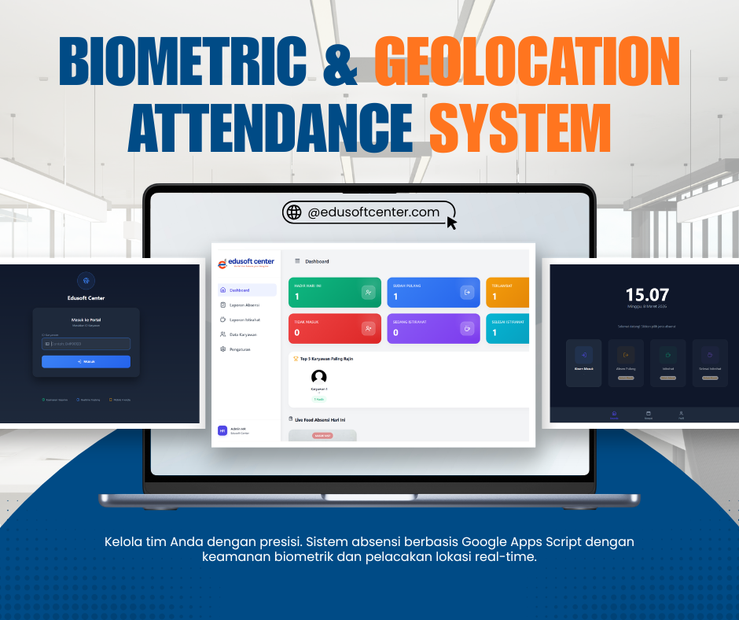


**Solusi absensi modern berbasis AI yang 100% gratis, tanpa server, dan tanpa biaya berlangganan.**

[🚀 Coba Demo Langsung](https://script.google.com/macros/s/AKfycby-V1L2NTWmB0qY8p6eyJQl7GXsjKpIF1mOgMs5Kpcvh4pfgpxy63_sqPdy27fPqjOG/exec) · [📖 Dokumentasi](#-cara-penggunaan) · [🐛 Laporkan Bug](../../issues) · [💡 Request Fitur](../../issues) · [📖 Read More](https://edusoftcenter.com/revolusi-absensi-cerdas-pengenalan-wajah-gps-berbasis-google-apps-script/)

</div>

---

## 📋 Daftar Isi

- [Tentang Proyek](#-tentang-proyek)
- [Fitur Utama](#-fitur-utama)
- [Cara Kerja Sistem](#-cara-kerja-sistem)
- [Teknologi yang Digunakan](#-teknologi-yang-digunakan)
- [Struktur Sistem](#-struktur-sistem)
- [Portal Karyawan](#-portal-karyawan-employee-interface)
- [Dashboard Admin](#-dashboard-panel-admin-hr-management)
- [Cara Penggunaan](#-cara-penggunaan)
- [Konfigurasi Google Spreadsheet](#-konfigurasi-google-spreadsheet)
- [Perbandingan dengan Sistem Konvensional](#-perbandingan-dengan-sistem-konvensional)
- [Persyaratan & Kompatibilitas](#-persyaratan--kompatibilitas)
- [Pertanyaan Umum (FAQ)](#-pertanyaan-umum-faq)
- [Kontribusi](#-kontribusi)
- [Lisensi](#-lisensi)
- [Demo](#-demo)

---

## 🌟 Tentang Proyek

Sistem absensi manual — baik berbasis kertas, mesin fingerprint mahal, maupun aplikasi berbayar — masih menjadi hambatan nyata bagi banyak perusahaan, terutama UMKM dan lembaga pendidikan. Masalah seperti ***buddy punching*** (titip absen), manipulasi data kehadiran, sulitnya rekap laporan, hingga tingginya biaya infrastruktur menjadi tantangan yang belum tuntas terpecahkan.

**Sistem Absensi Cerdas** hadir sebagai solusi komprehensif yang:

- ✅ **Gratis sepenuhnya** — memanfaatkan ekosistem Google (Apps Script + Spreadsheet)
- ✅ **Tanpa server** — tidak perlu hosting, VPS, atau database SQL berbayar
- ✅ **Anti-kecurangan** — verifikasi wajah AI memastikan karyawan hadir secara fisik
- ✅ **Akses dari mana saja** — berbasis web, bisa diakses via smartphone maupun desktop
- ✅ **Data milik Anda sendiri** — semua tersimpan di Google Spreadsheet akun Anda

Sistem ini memisahkan dua antarmuka utama: **Portal Karyawan** untuk kegiatan absensi harian, dan **Dashboard Admin HR** untuk manajemen, pemantauan, serta pelaporan.

---

## 🔥 Fitur Utama

| # | Fitur | Deskripsi |
|---|-------|-----------|
| 🤖 | **Verifikasi Wajah AI** | Menggunakan `face-api.js` untuk mencocokkan wajah karyawan secara real-time. Mencegah titip absen secara total. |
| 📍 | **Tracking GPS Real-time** | Menangkap koordinat Latitude/Longitude dan alamat lengkap saat absen. Memastikan karyawan berada di lokasi kerja. |
| ⏱️ | **Kalkulasi Durasi Otomatis** | Menghitung total jam & menit kerja secara otomatis dari Absen Masuk hingga Absen Pulang. |
| ☕ | **Break Management** | Memantau waktu mulai dan selesai istirahat beserta durasinya. Notifikasi otomatis jika melebihi batas waktu. |
| 📊 | **Dashboard Analitik** | Grafik kehadiran bulanan, statistik keterlambatan, dan papan peringkat Top 5 Karyawan Terajin. |
| 📥 | **Ekspor Sekali Klik** | Unduh laporan dalam format **Excel (.xlsx)** atau **PDF** langsung dari dashboard. |
| ☁️ | **100% Serverless** | Backend berjalan di Google Apps Script. Tidak ada biaya hosting atau pemeliharaan server. |
| 🔒 | **Autentikasi Berlapis** | Login NIK untuk karyawan, dan login username+password untuk admin HR. |
| 🪪 | **Generate ID Card** | Admin dapat mencetak kartu identitas karyawan langsung dari sistem. |
| 🕐 | **Live Feed Kehadiran** | Pembaruan real-time yang menampilkan foto, nama, status, dan lokasi karyawan yang baru absen. |

---

## ⚙️ Cara Kerja Sistem

```
┌─────────────────────────────────────────────────────────────┐
│                    ALUR ABSENSI KARYAWAN                    │
└─────────────────────────────────────────────────────────────┘

  Karyawan           Portal Web              Google Apps Script         Google Sheets
      │                   │                         │                        │
      │── Input NIK ──────►                         │                        │
      │                   │── Fetch Data Karyawan ──►                        │
      │                   │◄──── Data + Foto Wajah ──                        │
      │                   │                         │                        │
      │── Scan Wajah ─────►                         │                        │
      │       face-api.js membandingkan wajah live  │                        │
      │       dengan foto referensi dari database   │                        │
      │                   │                         │                        │
      │── GPS Otomatis ───►                         │                        │
      │       Geolocation API menangkap koordinat   │                        │
      │                   │                         │                        │
      │                   │── POST: NIK, Timestamp, │                        │
      │                   │        Koordinat GPS ───►                        │
      │                   │                         │── Simpan ke Sheet ─────►
      │                   │                         │                        │
      │                   │◄──── Konfirmasi Sukses ──                        │
      │◄─── Notifikasi ───│                         │                        │
```

### Alur Singkat:
1. **Karyawan** membuka portal web → masukkan **NIK**
2. Sistem mengambil data karyawan + **foto wajah referensi** dari Spreadsheet
3. Kamera aktif → `face-api.js` membandingkan wajah live dengan foto referensi
4. Jika cocok → **GPS ditangkap otomatis** via Geolocation API
5. Data absensi (NIK, waktu, koordinat, alamat) **dikirim ke Google Apps Script**
6. Apps Script **menyimpan ke Google Spreadsheet** secara otomatis
7. **Admin** dapat memantau semua aktivitas secara real-time dari Dashboard

---

## 🛠️ Teknologi yang Digunakan

| Teknologi | Versi | Fungsi |
|-----------|-------|--------|
| **Google Apps Script** | Latest | Backend serverless, routing, Web App hosting |
| **Google Spreadsheet** | - | Database utama: karyawan, log absensi, log istirahat |
| **face-api.js** | 0.22.2 | Deteksi & pengenalan wajah berbasis AI |
| **HTML/CSS/JavaScript** | ES6+ | Antarmuka portal karyawan & dashboard admin |
| **Geolocation API** | Browser API | Penangkapan koordinat GPS real-time |
| **Google Maps Geocoding** | v3 | Konversi koordinat menjadi alamat lengkap |
| **Chart.js** | - | Visualisasi grafik pada dashboard admin |
| **SheetJS (xlsx.js)** | - | Ekspor data ke format Excel (.xlsx) |
| **jsPDF** | - | Ekspor data ke format PDF |

---

## 🗂️ Struktur Sistem

```
sistem-absensi-cerdas/
│
├── 📁 Code.gs                  # Entry point Google Apps Script
├── 📁 DB.gs                    # Fungsi operasi Google Spreadsheet
├── 📁 Auth.gs                  # Autentikasi karyawan & admin
│
├── 📁 portal-karyawan/
│   ├── index.html              # Halaman utama portal
│   ├── login.html              # Form login NIK karyawan
│   ├── menu-absensi.html       # Menu pilihan absensi
│   └── scan-wajah.html         # Modal pemindaian wajah & GPS
│
├── 📁 dashboard-admin/
│   ├── login-admin.html        # Halaman login admin
│   ├── dashboard.html          # Dashboard utama & live feed
│   ├── log-absensi.html        # Tabel laporan absensi lengkap
│   ├── log-istirahat.html      # Tabel laporan istirahat
│   ├── data-karyawan.html      # Manajemen database karyawan
│   ├── upload-wajah.html       # Modal registrasi biometrik wajah
│   └── pengaturan.html         # Pengaturan sistem global
│
├── 📁 preview/                 # Screenshot tampilan sistem
│   ├── HalamanKaryawan1.png
│   ├── HalamanKaryawan2.png
│   ├── HalamanKaryawan3.png
│   ├── HalamanAdmin1.jpeg
│   ├── HalamanAdmin2.png
│   ├── HalamanAdmin3.png
│   ├── HalamanAdmin4.png
│   ├── HalamanAdmin5.png
│   └── HalamanAdmin6.png
│
├── Preview.png
├── VideoDemo.mp4
└── README.md
```

---

## 👨‍💻 Portal Karyawan (Employee Interface)

Portal karyawan adalah antarmuka yang digunakan setiap hari oleh seluruh karyawan melalui smartphone maupun komputer. Desainnya elegan dan berpusat pada proses pemindaian wajah (*face scanning*).

### 1. Halaman Utama (Main Portal)

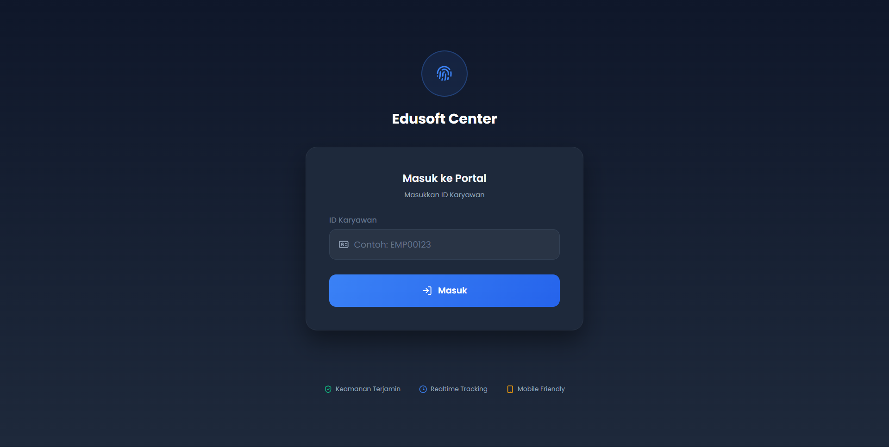

Tampilan awal portal yang modern dengan elemen radar/kamera berbentuk lingkaran di tengah layar sebagai pusat perhatian visual. Terdapat **4 tombol navigasi besar** yang jelas:

| Tombol | Fungsi |
|--------|--------|
| ✅ **Absen Masuk** | Mencatat jam kedatangan karyawan |
| 🏠 **Absen Pulang** | Mencatat jam kepulangan + menghitung total durasi kerja |
| ☕ **Mulai Istirahat** | Menandai awal periode istirahat |
| 🔔 **Selesai Istirahat** | Menandai akhir istirahat + mencatat durasinya |

---

### 2. Form Login NIK Karyawan

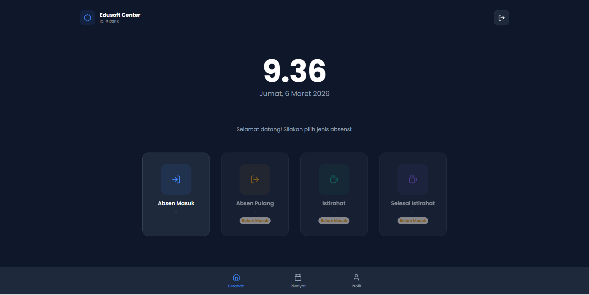

Halaman autentikasi pertama sebelum kamera diaktifkan. Karyawan memasukkan **NIK (Nomor Induk Karyawan)** mereka — sistem kemudian mengambil data identitas beserta **foto wajah referensi** dari database untuk digunakan sebagai pembanding saat proses pengenalan wajah berlangsung.

> 💡 **Keamanan:** Sistem tidak menyimpan gambar wajah karyawan dalam bentuk foto — melainkan dalam format *face descriptor* (representasi numerik) sehingga data biometrik lebih aman.

---

### 3. Jendela Autentikasi / Pemindaian Wajah

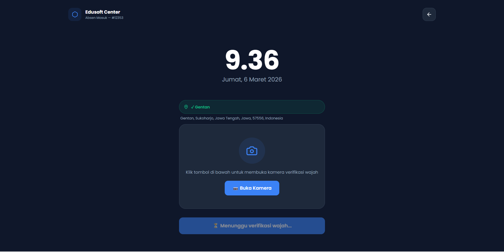

*Modal dialog* interaktif yang menampilkan proses verifikasi secara real-time. Karyawan cukup menatap kamera selama 1–2 detik, dan sistem akan:

- 🔍 Mendeteksi wajah dalam frame kamera
- 🧠 Membandingkan wajah live dengan data referensi menggunakan AI
- 📍 Secara bersamaan menangkap koordinat GPS via Geolocation API
- ✅ Menampilkan status: **"Wajah Cocok"** / **"Wajah Tidak Dikenali"**
- 💾 Secara otomatis menyimpan data ke Spreadsheet jika verifikasi berhasil

---

## 👑 Dashboard Panel Admin (HR Management)

Modul admin adalah ruang kendali penuh bagi tim HR — diamankan dengan autentikasi login, dan menyediakan akses ke seluruh data kehadiran, manajemen karyawan, serta konfigurasi sistem.

### 1. Halaman Login Panel Admin

Halaman login dengan autentikasi **username & password**. Akses ke seluruh fitur manajemen hanya dapat dilakukan oleh personel HR yang berwenang. Sistem menggunakan session token untuk menjaga keamanan sesi login.

---

### 2. Dashboard Utama & Live Feed

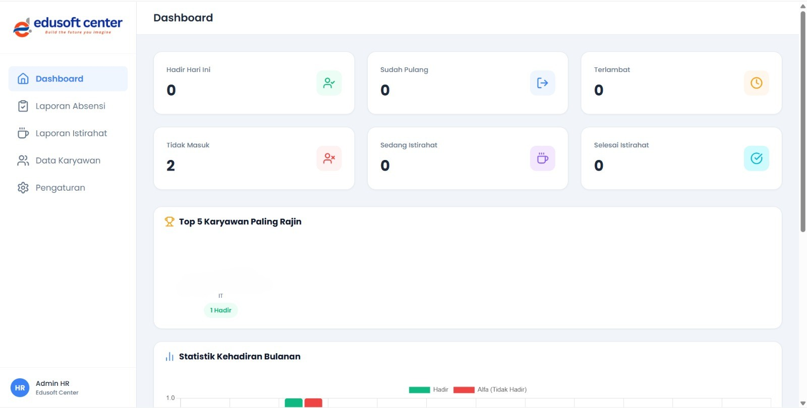

Pusat pemantauan real-time yang menyajikan:

**Kartu Statistik Hari Ini:**
```
┌──────────┐  ┌──────────┐  ┌──────────┐  ┌──────────┐
│  🟢 Hadir │  │ 🔵 Pulang │  │🔴Terlambat│  │⚫Tdk Masuk│
│    42    │  │    18    │  │     5    │  │     3    │
└──────────┘  └──────────┘  └──────────┘  └──────────┘
```

**Fitur Unggulan:**
- 🏆 **Top 5 Karyawan Paling Rajin** — papan peringkat dengan avatar melingkar
- 📡 **Live Feed Kehadiran** — stream real-time yang menampilkan foto, nama, status jam, dan lokasi GPS karyawan yang baru saja absen
- 📈 **Grafik Kehadiran Bulanan** — visualisasi tren kehadiran per hari dalam satu bulan

---

### 3. Log Laporan Absensi Lengkap

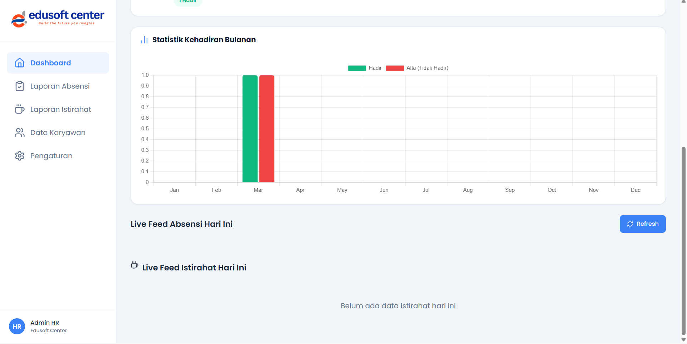

Tabel *responsive* yang merekap seluruh riwayat kehadiran. Kolom-kolom utama:

| Kolom | Deskripsi |
|-------|-----------|
| **Nama / NIK** | Identitas karyawan |
| **Jam Masuk** | Waktu absen masuk beserta lokasi GPS |
| **Jam Pulang** | Waktu absen pulang beserta lokasi GPS |
| **Durasi Total** | Format: *Bekerja X Jam Y Menit* |
| **Status** | Badge 🟢 *Tepat Waktu* atau 🔴 *Terlambat* |

**Fitur Filter:** Admin dapat memfilter tampilan tabel berdasarkan rentang tanggal menggunakan *Date Picker* bawaan. Seluruh data yang terfilter dapat langsung **diekspor ke Excel atau PDF**.

---

### 4. Log Laporan Istirahat

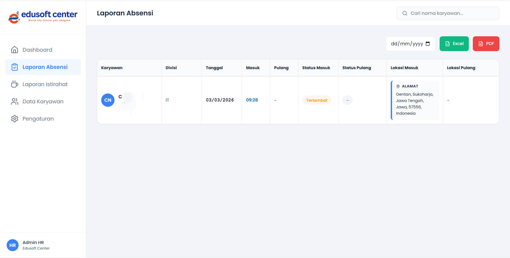

Tabel terpisah khusus untuk memantau rekap istirahat seluruh karyawan. Berguna untuk:

- Memastikan karyawan tidak melebihi batas waktu istirahat yang ditetapkan
- Melacak lokasi karyawan saat mulai dan selesai istirahat
- Mengidentifikasi pola istirahat yang tidak sesuai kebijakan

**Kolom utama:** NIK, Nama, Tanggal, Jam Mulai Istirahat, Jam Selesai Istirahat, **Durasi Istirahat**, Lokasi Mulai, Lokasi Selesai.

---

### 5. Data Registrasi Karyawan

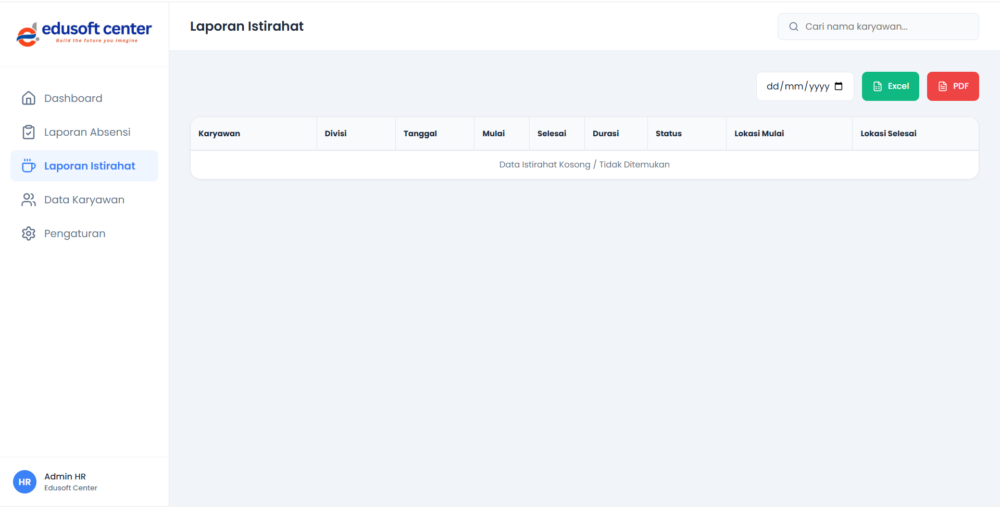

Halaman manajemen database personel perusahaan. Fitur-fitur utama:

- 👤 **Daftar Karyawan** lengkap dengan foto profil dan badge status biometrik
- 🟢 Badge **"Sudah Terdaftar"** — wajah telah terekam di sistem
- 🔴 Badge **"Belum Terdaftar"** — perlu dilakukan registrasi wajah
- ➕ Tombol **Tambah Karyawan Baru** dengan form isian lengkap
- 🪪 Tombol **Generate ID Card** — mencetak kartu identitas karyawan dengan desain profesional
- ✏️ Edit & hapus data karyawan yang sudah ada

---

### 6. Perekaman / Upload Basis Data Wajah

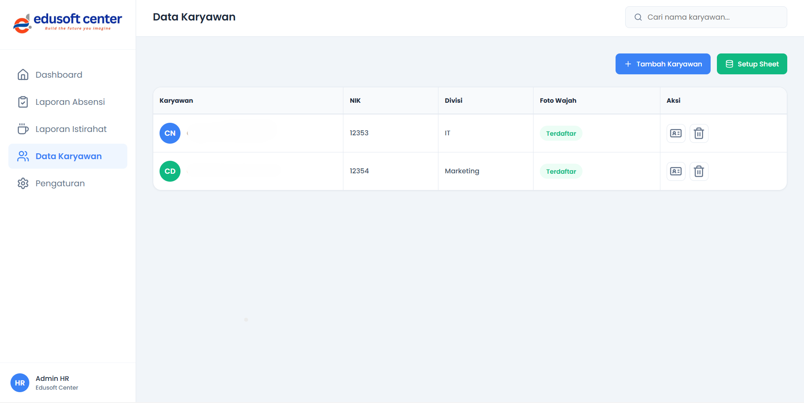

Modal antarmuka interaktif untuk mendaftarkan biometrik wajah karyawan baru ke dalam sistem AI. Proses registrasi:

1. Admin membuka halaman karyawan yang belum terdaftar
2. Klik tombol **"Daftarkan Wajah"**
3. Modal kamera aktif — arahkan wajah karyawan ke kamera
4. Sesuaikan *cropping* area wajah jika diperlukan
5. Sistem memproses dan menyimpan **face descriptor** dalam 1–2 detik
6. Badge karyawan berubah menjadi 🟢 *"Sudah Terdaftar"*

> ⚠️ **Catatan:** Untuk akurasi terbaik, lakukan registrasi wajah dalam kondisi pencahayaan yang cukup dan posisi wajah menghadap kamera secara langsung.

---

### 7. Pengaturan Sistem Global

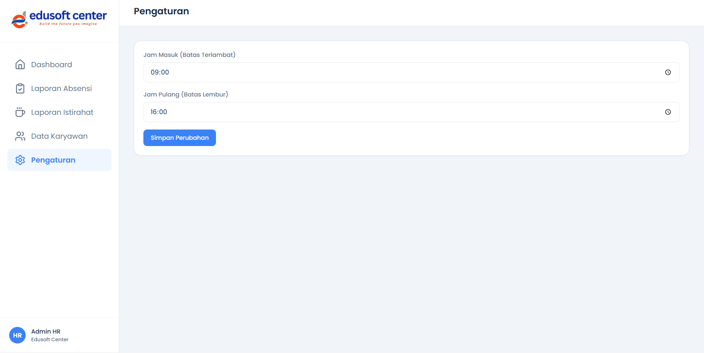

Portal konfigurasi ringan untuk tim HR. Parameter yang dapat disesuaikan:

| Pengaturan | Deskripsi | Default |
|------------|-----------|---------|
| **Batas Jam Masuk** | Jam terakhir dianggap "Tepat Waktu" | 08:00 |
| **Durasi Istirahat Maksimal** | Batas waktu istirahat yang diperbolehkan | 60 menit |
| **Nama Perusahaan** | Ditampilkan pada ID Card dan laporan | - |
| **Lokasi Kantor (Radius)** | Radius geofencing absensi (opsional) | - |
| **Username & Password Admin** | Kredensial login panel admin | - |

---

## 🚀 Cara Penggunaan

### Prasyarat

- Akun Google (Gmail) aktif
- Browser modern: **Google Chrome** (direkomendasikan), Firefox, atau Edge
- Akses ke **Google Apps Script** di [script.google.com](https://script.google.com)

---

### Langkah 1: Salin Kode ke Google Apps Script

1. Buka [Google Apps Script](https://script.google.com) → klik **New Project**
2. Salin seluruh isi file `Code.gs`, `DB.gs`, dan `Auth.gs` ke editor
3. Tambahkan file HTML (portal karyawan & dashboard admin) ke project
4. Klik **Save** (Ctrl+S)

### Langkah 2: Buat Google Spreadsheet

1. Buka [Google Sheets](https://sheets.google.com) → buat spreadsheet baru
2. Buat sheet/tab berikut:
   - `DataKaryawan` — master data karyawan
   - `LogAbsensi` — log harian absensi masuk & pulang
   - `LogIstirahat` — log waktu istirahat
   - `FaceData` — penyimpanan face descriptor AI
   - `Settings` — konfigurasi sistem
3. Salin **URL Spreadsheet** Anda

### Langkah 3: Hubungkan Spreadsheet ke Script

1. Di Apps Script, buka file `DB.gs`
2. Temukan variabel `SPREADSHEET_ID` dan isi dengan ID spreadsheet Anda:
   ```javascript
   const SPREADSHEET_ID = "masukkan_id_spreadsheet_anda_di_sini";
   ```
   > 💡 ID Spreadsheet dapat ditemukan di URL: `https://docs.google.com/spreadsheets/d/**[ID_DI_SINI]**/edit`

### Langkah 4: Deploy sebagai Web App

1. Klik **Deploy** → **New Deployment**
2. Pilih type: **Web App**
3. Konfigurasi:
   - **Execute as:** `Me (nama akun Google Anda)`
   - **Who has access:** `Anyone` (agar karyawan bisa mengakses tanpa login Google)
4. Klik **Deploy** → izinkan permission yang diminta
5. Salin **Web App URL** yang diberikan — ini adalah URL portal Anda

### Langkah 5: Konfigurasi Awal Admin

1. Buka Web App URL, tambahkan `?page=admin-login` di akhir URL
2. Login dengan kredensial default:
   - Username: `admin`
   - Password: `admin123`
3. Segera ubah password di menu **Pengaturan Sistem**
4. Mulai tambahkan data karyawan via menu **Data Karyawan**
5. Daftarkan wajah setiap karyawan via fitur **Upload Wajah**

---

## 📊 Konfigurasi Google Spreadsheet

### Struktur Sheet `DataKaryawan`

| Kolom | Header | Tipe Data | Contoh |
|-------|--------|-----------|--------|
| A | NIK | Teks | `EMP-001` |
| B | Nama Lengkap | Teks | `Budi Santoso` |
| C | Jabatan | Teks | `Staff IT` |
| D | Departemen | Teks | `Teknologi` |
| E | Email | Teks | `budi@perusahaan.com` |
| F | No. Telepon | Teks | `08123456789` |
| G | Tanggal Bergabung | Tanggal | `01/01/2024` |
| H | Status Wajah | Teks | `Terdaftar` / `Belum` |
| I | Face Descriptor | JSON | *(diisi otomatis oleh sistem)* |

### Struktur Sheet `LogAbsensi`

| Kolom | Header | Deskripsi |
|-------|--------|-----------|
| A | Tanggal | Tanggal absensi |
| B | NIK | ID karyawan |
| C | Nama | Nama karyawan |
| D | Jam Masuk | Timestamp absen masuk |
| E | Lokasi Masuk | Koordinat + Alamat masuk |
| F | Jam Pulang | Timestamp absen pulang |
| G | Lokasi Pulang | Koordinat + Alamat pulang |
| H | Durasi Kerja | Total jam & menit bekerja |
| I | Status | `Tepat Waktu` / `Terlambat` |

---

## 📈 Perbandingan dengan Sistem Konvensional

| Aspek | Mesin Fingerprint | Aplikasi HR Berbayar | **Sistem Ini** |
|-------|:-----------------:|:-------------------:|:--------------:|
| **Biaya awal** | Rp 2–10 juta | Rp 500rb–2jt/bln | **Rp 0** |
| **Biaya bulanan** | Rp 0 | Rp 500rb–2jt | **Rp 0** |
| **Anti titip absen** | ✅ (Fingerprint) | ❌ | **✅ (Wajah AI)** |
| **Tracking lokasi GPS** | ❌ | Sebagian | **✅ Real-time** |
| **Akses dari mana saja** | ❌ | ✅ | **✅** |
| **Rekap otomatis** | Sebagian | ✅ | **✅** |
| **Ekspor Excel/PDF** | Terbatas | ✅ | **✅** |
| **Instalasi hardware** | ✅ Wajib | ❌ | **❌ Tidak perlu** |
| **Pemeliharaan IT** | Tinggi | Sedang | **Minimal** |
| **Data di server sendiri** | ❌ | ❌ | **✅ Google Drive** |
| **Skalabilitas** | Terbatas | ✅ | **✅ Fleksibel** |

---

## 💻 Persyaratan & Kompatibilitas

### Browser yang Didukung

| Browser | Versi Minimum | Status |
|---------|--------------|--------|
| Google Chrome | 90+ | ✅ Fully Supported (Direkomendasikan) |
| Mozilla Firefox | 88+ | ✅ Supported |
| Microsoft Edge | 90+ | ✅ Supported |
| Safari (iOS 15+) | 15+ | ⚠️ Partial (GPS mungkin perlu izin manual) |
| Opera | 76+ | ✅ Supported |
| Chrome Mobile (Android) | 90+ | ✅ Fully Supported |

### Izin yang Diperlukan

Saat membuka portal pertama kali, browser akan meminta:

- 📷 **Izin Kamera** — wajib untuk proses pengenalan wajah
- 📍 **Izin Lokasi** — wajib untuk pencatatan koordinat GPS
- 🔔 **Izin Notifikasi** — opsional, untuk konfirmasi absensi

> ⚠️ Pengguna **harus** mengizinkan akses kamera dan lokasi. Sistem tidak dapat berfungsi tanpa kedua izin ini.

### Kondisi Optimal

- 💡 **Pencahayaan cukup** untuk akurasi pengenalan wajah
- 📶 **Koneksi internet** aktif (minimal 3G/4G)
- 👤 **Posisi wajah** menghadap kamera secara langsung
- 🧣 Tidak menggunakan aksesori yang menutupi wajah secara signifikan

---

## ❓ Pertanyaan Umum (FAQ)

**Q: Apakah data karyawan aman?**
> A: Ya. Semua data tersimpan di Google Spreadsheet milik akun Google Anda sendiri. Pihak ketiga tidak memiliki akses. Data face descriptor disimpan dalam bentuk numerik terenkripsi, bukan foto.

**Q: Berapa banyak karyawan yang bisa didaftarkan?**
> A: Tidak ada batasan teknis dari sistem ini. Batas efektif bergantung pada kapasitas Google Spreadsheet (5 juta sel per spreadsheet) dan kuota Google Apps Script (6 menit eksekusi per call, 90 menit/hari untuk akun gratis).

**Q: Apakah sistem bisa digunakan secara offline?**
> A: Tidak. Sistem membutuhkan koneksi internet aktif karena backend berjalan di Google Apps Script (cloud).

**Q: Bagaimana jika karyawan tidak dikenali sistemnya?**
> A: Karyawan perlu melakukan registrasi ulang wajah oleh admin. Pastikan kondisi pencahayaan memadai saat registrasi. Admin juga dapat melakukan absensi manual melalui dashboard jika diperlukan.

**Q: Apakah bisa diintegrasikan dengan sistem payroll?**
> A: Data log absensi tersimpan di Google Spreadsheet sehingga dapat diekspor ke Excel dan diintegrasikan secara manual dengan sistem payroll apapun. Integrasi API otomatis membutuhkan pengembangan tambahan.

**Q: Apakah ada batas kuota Google Apps Script?**
> A: Akun Google gratis memiliki kuota harian 90 menit runtime dan 20.000 URL fetch/hari. Untuk perusahaan besar (>200 karyawan), disarankan menggunakan **Google Workspace** untuk kuota yang lebih tinggi.

**Q: Apakah bisa menambahkan lokasi geofencing?**
> A: Fitur geofencing (pembatasan radius absen) tersedia di menu Pengaturan. Admin dapat mendefinisikan koordinat kantor dan radius maksimal yang diperbolehkan untuk absensi.

---

## 🤝 Kontribusi

Kontribusi sangat disambut! Jika Anda ingin berkontribusi:

1. **Fork** repository ini
2. Buat **branch** fitur baru: `git checkout -b fitur/nama-fitur-baru`
3. **Commit** perubahan: `git commit -m 'Tambah: deskripsi fitur'`
4. **Push** ke branch: `git push origin fitur/nama-fitur-baru`
5. Buat **Pull Request**

### Ide Kontribusi

- [ ] Notifikasi email/WhatsApp otomatis untuk keterlambatan
- [ ] Integrasi Google Calendar untuk jadwal shift
- [ ] Fitur pengajuan cuti langsung dari portal karyawan
- [ ] Mode gelap (Dark Mode) pada portal karyawan
- [ ] Fitur geofencing berbasis radius kantor
- [ ] Laporan analitik bulanan otomatis via email

---

## 📄 Lisensi

Proyek ini dilisensikan di bawah **MIT License** — bebas digunakan, dimodifikasi, dan didistribusikan untuk keperluan pribadi maupun komersial dengan tetap mencantumkan atribusi.

```
MIT License

Copyright (c) 2024

Permission is hereby granted, free of charge, to any person obtaining a copy
of this software and associated documentation files (the "Software"), to deal
in the Software without restriction, including without limitation the rights
to use, copy, modify, merge, publish, distribute, sublicense, and/or sell
copies of the Software, and to permit persons to whom the Software is
furnished to do so, subject to the following conditions:

The above copyright notice and this permission notice shall be included in all
copies or substantial portions of the Software.
```

---

## 🔗 Demo

Ingin melihat sistem ini secara langsung tanpa instalasi?

<div align="center">

### 🎬 Video Demo

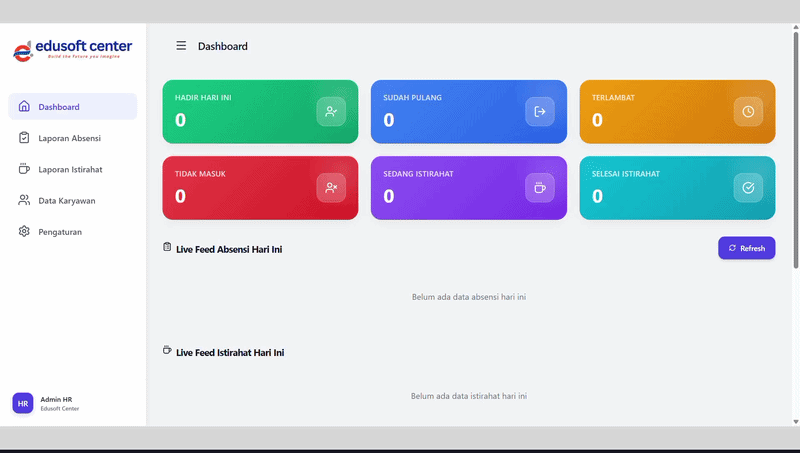

<br>

### 👉 [Coba Demo Live Sekarang](https://script.google.com/macros/s/AKfycby-V1L2NTWmB0qY8p6eyJQl7GXsjKpIF1mOgMs5Kpcvh4pfgpxy63_sqPdy27fPqjOG/exec)

*Demo tersedia untuk eksplorasi fitur portal karyawan maupun dashboard admin.*  
*Untuk implementasi di perusahaan Anda, ikuti panduan instalasi di atas.*

</div>

---

<div align="center">

**Dibuat dengan menggunakan Google Apps Script & face-api.js**

⭐ Jika proyek ini bermanfaat, jangan lupa berikan **Star** di GitHub!

</div>
