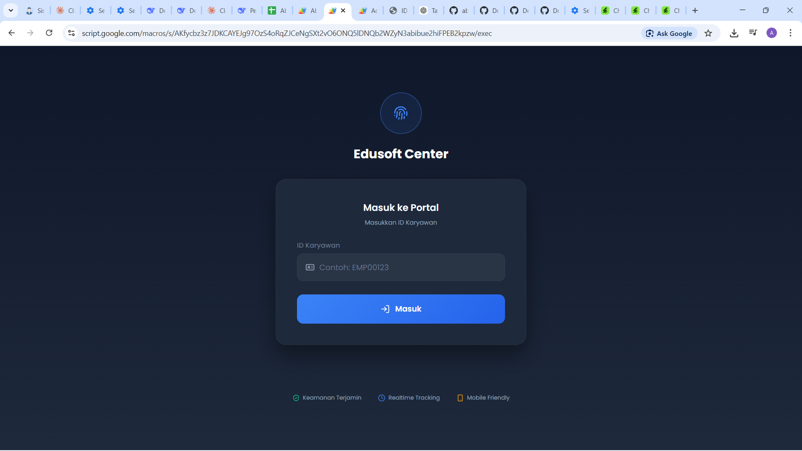
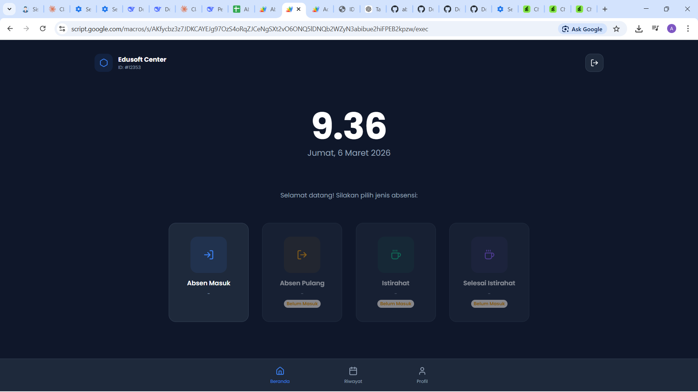
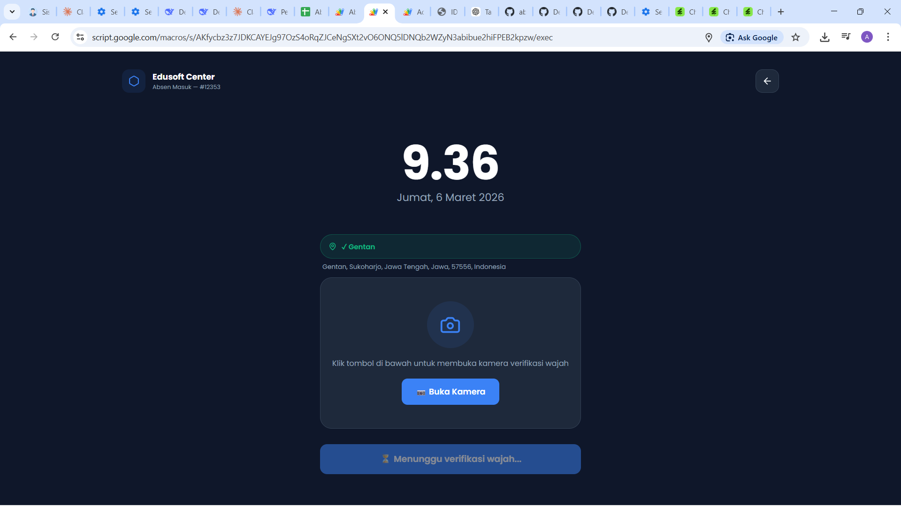
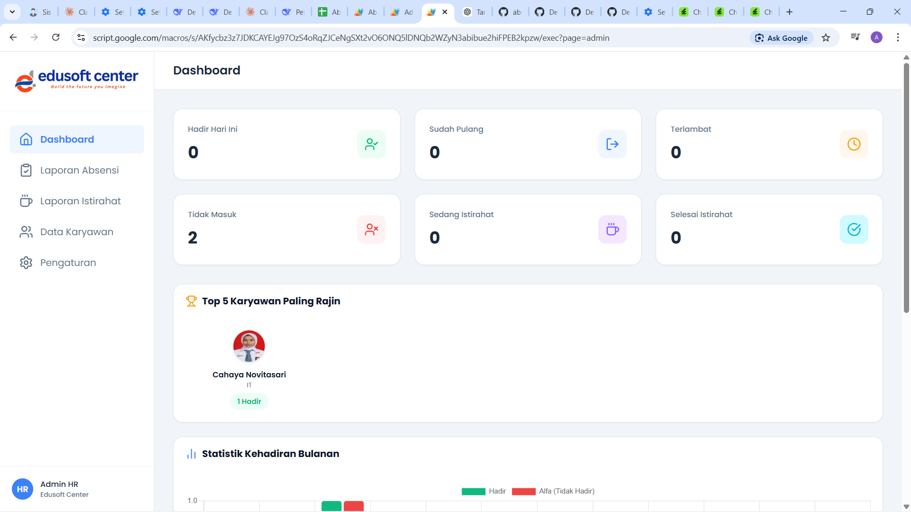
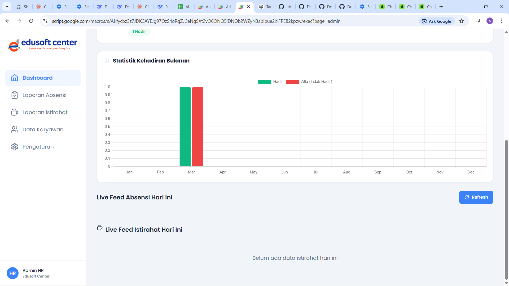
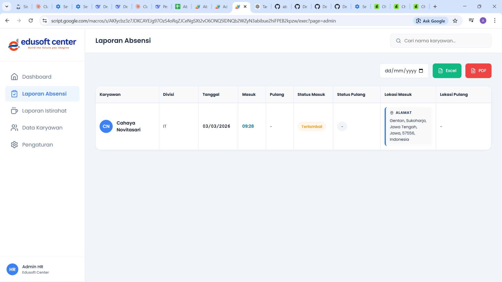
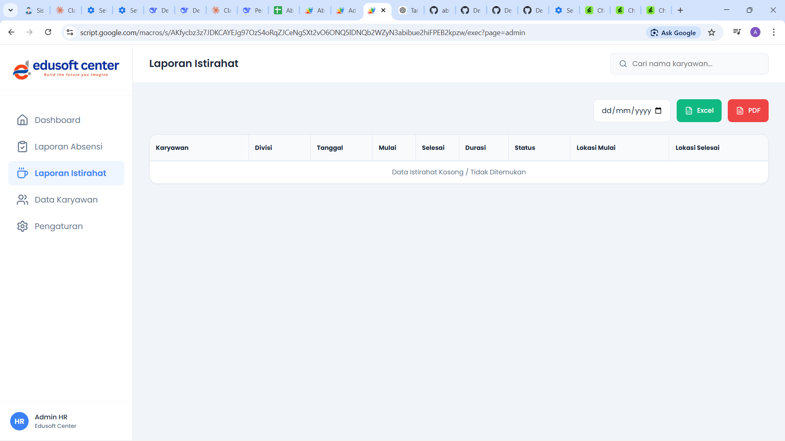
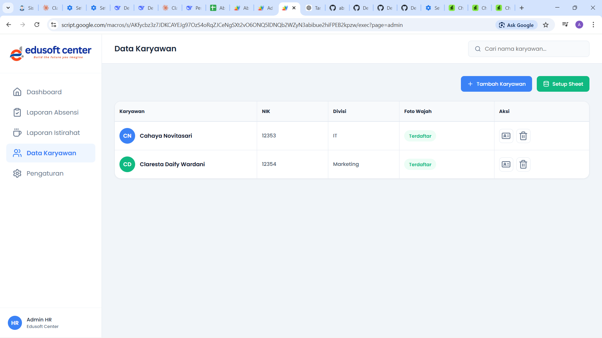
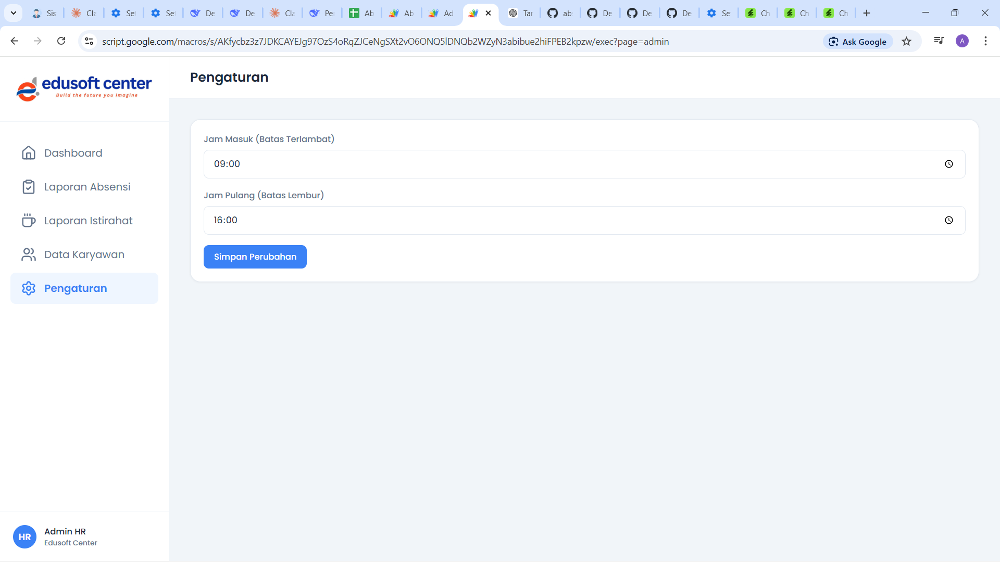

# Sistem Absensi Cerdas Berbasis Face Recognition 📸📍

Sebuah sistem absensi komprehensif berbasis **Web App Google Apps Script** yang memanfaatkan Kecerdasan Buatan (AI) untuk verifikasi **Pengenalan Wajah (Face Recognition)** dan pelacakan **Lokasi GPS** secara real-time. Sistem ini dirancang untuk mempermudah HRD dan perusahaan dalam mengelola kehadiran karyawan, memastikan bahwa karyawan berada di lokasi kerja, serta mencegah kecurangan absensi.

Seluruh data karyawan, log kehadiran, dan rekaman istirahat secara otomatis dan rapi disimpan ke dalam satu pusat **Google Spreadsheet** untuk memudahkan pengelolaan arsip data. Sistem memisahkan antara Portal Karyawan (untuk melakukan absen) dan Dashboard Admin HR (untuk pengelolaan).

---

## 🔥 Fitur Utama Sistem

*   **Pendeteksi & Verifikasi Wajah AI (`face-api.js`):** Memastikan karyawan yang absen adalah orang yang benar-benar terdaftar di dalam sistem melalui pencocokan wajah.
*   **Tracking Lokasi Real-time:** Menangkap koordinat titik lokasi GPS (Latitude/Longitude) beserta alamat rumah/kantor secara detail setiap kali karyawan absen.
*   **Kalkulasi Durasi Kerja Otomatis:** Sistem mendeteksi jumlah persis "Jam & Menit" yang dihabiskan karyawan dari sejak mereka *Absen Masuk* hingga *Absen Pulang* secara mutlak.
*   **Manajemen Waktu Istirahat (Break Management):** Pemantauan khusus untuk melacak kapan karyawan mulai beristirahat dan selesai, beserta durasi spesifik istirahatnya.
*   **Dashboard Admin Analitik:** Ringkasan berupa grafik kehadiran bulanan, statistik persentase keterlambatan, dan fitur unggulan "Top 5 Karyawan Terajin".
*   **Ekspor Data Sekali Klik:** Mengunduh atau mencetak laporan log harian ke format **Excel (.xlsx)** atau **PDF** dalam satu cetusan klik.
*   **Database Bebas Server (Serverless):** Memanfaatkan daya komputasi dari ekosistem gratis Google Apps Script dan Google Spreadsheet tanpa perlu berlangganan *hosting* atau *database* SQL luar.

---

## 👨‍💻 Portal Karyawan (Employee Interface)

Portal ini digunakan oleh karyawan sehari-harinya melalui *smartphone* atau komputer untuk melaporkan kehadiran dan status jam istirahat. Antarmukanya dibuat elegan, berpusat pada pemindaian wajah (*scanning*).

### 1. Halaman Utama (Main Portal)

*(Catatan: Halaman ini berisi radar/kamera pemindaian lingkaran yang modern di bagian tengah layar, diikuti 4 tombol navigasi besar untuk Absen Masuk, Pulang, Mulai Istirahat, dan Selesai Istirahat.)*

### 2. Form Login NIK Karyawan

Halaman Autentikasi kilat tempat karyawan menginput **NIK (Nomor Induk Karyawan)** mereka sebelum mengaktifkan kamera agar sistem bisa mengambil identitas dan wajah rujukan yang terasosiasi dengannya.

### 3. Jendela Autentikasi / Pemindaian

Sebuah *modal dialog* yang menampilkan hasil komputasi *Face API* secara seketika — apakah wajah terdeteksi (Cocok/Tidak Cocok), dan apakah layanan Lokasi GPS menyala (Geolokasi sukses diperoleh). Karyawan cukup diam sejenak dan *sistem akan secara cerdas mem-validasi* dan menyimpan data.

---

## 👑 Dashboard Panel Admin (HR Management)

Modul terpisah dan diamankan bagi HRD (Human Resource) untuk mengawasi seluruh riwayat aktivitas, menambahkan data karyawan, mengatur *rules* parameter absen, hingga mengekspor rekap laporan.

### 1. Dashboard Utama & Live Feed

Menyajikan statistik kardinal hari ini: jumlah karyawan Hadir, Pulang, Terlambat, dan Tidak Masuk. Di bawahnya, terdapat papan medali melingkar untuk **Top 5 Karyawan Paling Rajin** serta *Live Feed* (*feed* kehadiran) yang terus mengupdate foto, nama, status jam, dan lokasi orang-orang yang baru saja absen.

### 2. Log Laporan Absensi Lengkap

Sebuah rekam jejak tabel besar (*responsive*) yang mengumpulkan riwayat absen per hari. Meliputi ringkasan Jam Masuk, Jam Pulang, **Durasi Total (Bekerja X Jam Y Menit)**, dan lencana bewarna ganda (merah/hijau) untuk status kedisiplinan (Terlambat, Tepat Waktu). Administrator dapat memfilter riwayat berdasarkan tanggal menggunakan *Date Picker*.

### 3. Log Laporan Istirahat

Tabel khusus untuk menahan rekap *Log Istirahat*. Kolom **Durasi** dan titik **Lokasi Mulai/Selesai** berguna untuk memastikan karyawan kembali dari masa jedanya (*break*) dalam ambang batas jam yang dibolehkan perusahaan.

### 4. Data Registrasi Karyawan

Lokasi untuk mengurus *database* personel perusahaan. Menampilkan *badge* apakah wajah karyawan "Sudah Terdaftar" atau "Belum Terdaftar". Menyediakan fitur tombol untuk menambah karyawan baru dan menerbitkan / meng-*generate* kartu pengenal (ID Card) cetak untuk si karyawan.

### 5. Perekaman / Upload Basis Wajah Muka

Modal antarmuka interaktif yang dipanggil oleh Admin untuk mendidik (mendaftarkan) rupa wajah karyawan untuk pertama kalinya ke dalam *database*. Admin dapat menyesuaikan rasio muka (*cropping*) dan mencetak *biometrics* untuk referensi model AI selama 1-2 detik.

### 6. Pengaturan Sistem Global

Portal ringan (*Settings*) tempat HRD memodifikasi landasan sistem. Digunakan terutama untuk mendefinisikan Batas Ambang **Jam Masuk** default untuk mem-variabelkan *Badge "Terlambat"* di ujung bulan.
